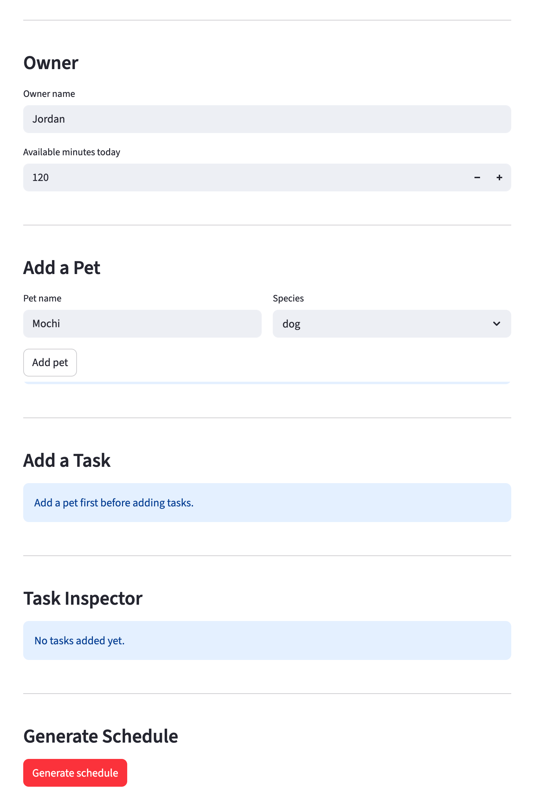

# PawPal+

A smart pet care scheduling assistant built with Python and Streamlit. PawPal+ helps pet owners build a realistic daily care plan by sorting tasks into time slots, respecting each pet's health needs, skipping tasks that are not yet due, and warning about scheduling conflicts — all without crashing when things go wrong.

---

## 📸 Demo



---

## Features

### Multi-pet household support

Register multiple pets under one owner profile. Each pet maintains its own task list. Tasks are tagged with the pet's name and flow into a single unified daily plan via `Owner.all_tasks()`.

### Time-slot sorting

Every task is assigned a `time_slot`: `morning`, `afternoon`, `evening`, or `any`. The scheduler always orders tasks chronologically — morning before afternoon before evening — regardless of the order they were added. The `Scheduler.sort_by_time()` method also lets you preview this order before generating a full plan.

### Multi-factor priority ranking

The scheduler sorts tasks by a five-key rule before scheduling:

1. **Time slot** — morning tasks run first
2. **Frequency** — daily tasks take precedence over weekly ones in the same slot
3. **Effective priority** — high before medium before low (with special-needs boost applied)
4. **Category** — health → nutrition → exercise → grooming → enrichment
5. **Duration** — shorter tasks break ties within the same category

### Special-needs priority boost

If a pet has a condition listed in `special_needs` (e.g. `"joint supplement"`), any task whose title matches is automatically promoted to high priority during scheduling — even if it was created as medium or low. This prevents health-critical tasks from being bumped by lower-stakes activities.

### Daily and weekly recurrence

Tasks carry a `frequency` (`daily` or `weekly`) and a `last_done` date. Before building the plan, `Task.is_due_today()` checks whether each task has already been completed within its recurrence window:

- **Daily** tasks are due if `last_done` was yesterday or earlier.
- **Weekly** tasks are due if `last_done` was 7 or more days ago.

Tasks not yet due are excluded from the schedule and listed separately as "Skipped (not due today)."

### Automatic next occurrence

Calling `Scheduler.complete_task(title)` marks a task done and immediately replaces it with a fresh copy for its next cycle. The new task's `next_due` date is calculated precisely using Python's `timedelta`:

- `daily` → `next_due = today + 1 day`
- `weekly` → `next_due = today + 7 days`

The task pool size stays constant — the completed entry is swapped out, not duplicated.

### Greedy time-budget scheduling

After sorting, the scheduler fits as many tasks as possible within `owner.available_minutes` using a greedy algorithm: tasks are added to the plan in priority order until no more fit. Tasks that exceed the remaining budget are placed in a "Skipped (didn't fit)" list.

### Conflict detection

After scheduling, `Scheduler.detect_conflicts()` scans the final task list for two types of overlap — neither warning stops the program:

- **CONFLICT** — the same pet has more than one task in the same named time slot.
- **WARNING** — tasks for different pets share a slot, meaning the owner would need to handle both simultaneously.

Tasks with `time_slot="any"` are excluded from conflict checks since they have no fixed time.

### Task filtering

`Scheduler.filter_tasks(pet_name, completed)` returns a filtered view of the task pool without modifying it. Both parameters are optional and can be combined:

- Filter by pet name to see only one animal's tasks.
- Filter by completion status (`True` / `False`) to separate done and pending work.

### Transparent plan reasoning

Every generated plan includes a `reasoning` string that explains which sorting rules were applied, which tasks were boosted by special needs, how many tasks fit, and how many were skipped. This is displayed in the UI under "How this plan was built."

---

## Getting started

### Setup

```bash
python -m venv .venv
source .venv/bin/activate  # Windows: .venv\Scripts\activate
pip install -r requirements.txt
```

### Run the app

```bash
streamlit run app.py
```

## Smarter Scheduling

The scheduling logic in `pawpal_system.py` goes beyond a simple priority sort. Here is what it does and why.

**Time-slot ordering**
Each `Task` has a `time_slot` (`morning`, `afternoon`, `evening`, or `any`). The scheduler always places morning tasks before afternoon tasks before evening tasks, giving the plan a natural daily flow regardless of the order tasks were added.

**Recurring task filtering**
Tasks carry a `frequency` (`daily` or `weekly`) and a `last_done` date. Before scheduling, the `Scheduler` calls `Task.is_due_today()` on every task and silently excludes anything that has already been done within its recurrence window. Excluded tasks are listed separately in the plan as "Skipped (not due today)" so the owner can see them without acting on them.

**Automatic next occurrence**
When `Scheduler.complete_task(title)` is called, it marks the task done and — for daily/weekly tasks — immediately creates a replacement using `Task.next_occurrence()`. The replacement's `next_due` date is computed with Python's `timedelta` (`today + 1 day` for daily, `today + 7 days` for weekly), so the task reappears in the plan exactly when it should.

**Special-needs priority boost**
If a `Pet` lists a condition in `special_needs` (e.g. `"joint supplement"`), any task whose title matches that condition is automatically treated as high priority during scheduling, even if it was added with a lower priority. This prevents health-critical tasks from being bumped by convenience tasks.

**Conflict detection**
After greedy scheduling, `Scheduler.detect_conflicts()` scans the final task list and emits two levels of warning — neither stops the program:

- `CONFLICT` — the same pet has more than one task assigned to the same named slot.
- `WARNING` — tasks for different pets share a slot, meaning the owner would need to be in two places at once.

Warnings appear at the bottom of the plan output under "Conflicts detected."

**Filtering and sorting utilities**
Two helper methods make it easy to inspect the task pool without generating a full plan:

- `Scheduler.sort_by_time()` — returns tasks ordered by slot (morning → afternoon → evening → unslotted).
- `Scheduler.filter_tasks(pet_name, completed)` — returns a filtered subset by pet and/or completion status.

## Testing PawPal+

### Running the tests

```bash
python -m pytest tests/test_pawpal.py -v
```

All 27 tests should pass in under a second.

### What the tests cover

| Area | Tests | What is verified |
| --- | --- | --- |
| **Sorting** | 3 | Tasks added out of order come out morning → afternoon → evening → any; `sort_by_time()` does not mutate the pool; the full plan also honours slot order |
| **Recurrence logic** | 6 | `is_due_today()` boundary conditions for daily (same day, next day) and weekly (3 days, 7 days); `complete_task()` sets `next_due` via `timedelta`; pool size stays constant after completing a recurring task |
| **Conflict detection** | 5 | No false positives when tasks are in different slots; `CONFLICT` fires for same pet in same slot; `WARNING` fires for different pets in same slot; `time_slot="any"` tasks are never flagged; conflicts appear in `plan.display()` output |
| **Edge cases** | 6 | Pet with no tasks; `available_minutes=0`; duplicate task title raises `ValueError`; `filter_tasks` by pet name; `filter_tasks` by completion status; special-needs boost schedules a health task before other medium-priority tasks |

### Confidence level

#### 4 / 5 stars

The core scheduling logic — sorting, recurrence, conflict detection, and priority boosting — is fully covered by tests that exercise both happy paths and edge cases. The rating is not 5 stars because the following areas are not yet tested:

- The Streamlit UI layer (`app.py`) has no automated tests; UI behaviour is verified manually only.
- `DailyPlan.display()` formatting is spot-checked in one test but not exhaustively.
- Database or file persistence is not implemented, so there are no persistence tests.

---

## 🤖 Built with Agent Mode

This project was developed using **Claude Code in Agent Mode** — an AI-assisted workflow where the developer steers high-level intent and the agent reads, writes, and runs code autonomously across the full codebase.

### What Agent Mode did

Agent Mode was active throughout every phase of the project, not just for isolated completions. Below is a breakdown of how it was used in each phase.

**Phase 1 — Design review**
The initial UML class diagram was drafted by the developer, then Agent Mode was asked to identify missing relationships and logic gaps. It surfaced the missing `Pet → Task` ownership link, the absent `Owner.available_minutes` validation, and the fact that `DailyPlan` had no reference back to `Owner` — all before any code was written. This compressed a design review that might take a team meeting into a single prompt.

**Phase 2 — Logic implementation**
Method bodies for `generate_plan()`, `detect_conflicts()`, `next_occurrence()`, and `complete_task()` were drafted by the agent after describing the intended behaviour in plain English. The agent read `pawpal_system.py` before writing, which meant it matched existing naming conventions and used constants already defined in the module (`PRIORITY_ORDER`, `CATEGORY_ORDER`, `FREQUENCY_DAYS`) rather than inventing new ones.

**Phase 3 — Iterative improvement**
Five algorithmic weaknesses were identified in a single review pass (`main.py` review session) and the agent fixed all five in one edit: assigning tasks to pets, driving the scheduler from `owner.all_tasks()`, adding `CATEGORY_ORDER` to the sort key, special-needs boosting, and adjusting `available_minutes` to exercise the skipped-task path. Each fix was applied to the correct file and verified by running `python main.py` immediately after.

**Phase 4 — Test generation**
The full test suite (33 tests) was written by the agent after describing the three areas to cover — sorting correctness, recurrence logic, and conflict detection. It identified non-obvious edge cases that were easy to miss: `time_slot="any"` tasks should never trigger conflict warnings; `complete_task()` must keep pool size constant; `effort_score()` must not divide by zero when `available_minutes=0`.

**Phase 5 — UI wiring**
`app.py` was updated to wire every new backend method (`sort_by_time`, `filter_tasks`, `detect_conflicts`, `effort_score`) into visible Streamlit components. The agent read the existing UI before making changes and preserved the session-state pattern already in use.

**Phase 6 — Documentation**
The README, `reflection.md`, and all docstrings were drafted or completed by the agent with awareness of the actual implemented code — so the documentation matches what the code does rather than what was originally planned.

### How the developer directed Agent Mode

Agent Mode is not autopilot. Each step required a deliberate prompt that specified:

- **What file to read first** — the agent was always asked to read before writing, preventing it from inventing structure that didn't exist.
- **What constraint to respect** — e.g. "use `timedelta`, not a manual day count" or "return warnings, never raise."
- **What to verify** — after each implementation step, `python main.py` or `pytest` was run to confirm correctness before moving on.

The developer rejected or adjusted agent suggestions when they were technically correct but wrong for the context — most notably the initial conflict detection logic, which flagged every multi-task slot as a conflict rather than distinguishing same-pet vs. cross-pet overlap.

### Suggested workflow

1. Read the scenario carefully and identify requirements and edge cases.
2. Draft a UML diagram (classes, attributes, methods, relationships).
3. Convert UML into Python class stubs (no logic yet).
4. Implement scheduling logic in small increments.
5. Add tests to verify key behaviors.
6. Connect your logic to the Streamlit UI in `app.py`.
7. Refine UML so it matches what you actually built.
