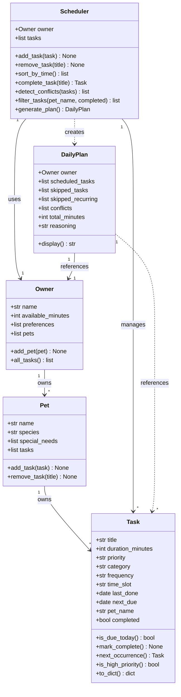

# PawPal+ Project Reflection

## 1. System Design

**Core user actions:**

1. **Enter owner and pet information.** The user provides basic profile details — their name, available time per day, and their pet's name, species, and any special needs. This context is used by the scheduler to personalize and constrain the daily plan.

2. **Add and edit care tasks.** The user can create tasks such as walks, feeding, medication, grooming, and enrichment activities. Each task has at least a name, estimated duration, and priority level. Users can also edit or remove existing tasks as their pet's needs change.

3. **Generate a daily care plan.** The user requests a schedule that fits within their available time. The app prioritizes tasks by importance, respects time constraints, and displays the resulting plan along with a brief explanation of why tasks were included, ordered, or omitted.

**a. Initial design**

The design uses five classes. `Owner` and `Pet` are pure data holders that represent the people and animals involved. `Task` models a single care activity. `Scheduler` contains the planning logic. `DailyPlan` is the output object the UI displays.

**Owner** — holds the context that constrains the schedule.
- Attributes: `name`, `available_minutes`, `preferences`, `pet` (Owner owns the Pet)
- No behavior methods; its data is read directly by the Scheduler.

**Pet** — holds the pet's profile, referenced through Owner.
- Attributes: `name`, `species`, `special_needs`
- No behavior methods; its data informs which tasks the Scheduler considers.

**Task** — represents one care activity to be scheduled.
- Attributes: `title`, `duration_minutes`, `priority` ("low"/"medium"/"high"), `category`
- `is_high_priority()` → convenience check used during sorting
- `to_dict()` → serializes the task for display in the UI

**Scheduler** — the planning engine; owns the task pool and produces the plan.
- Attributes: `owner`, `tasks`
- `add_task(task)` / `remove_task(title)` → manage the task pool
- `generate_plan()` → selects and orders tasks that fit within `owner.available_minutes`, ranked by priority then duration; returns a `DailyPlan`

**DailyPlan** — the read-only output of `generate_plan()`.
- Attributes: `scheduled_tasks`, `total_minutes`, `skipped_tasks`, `reasoning`
- `display()` → returns a formatted string of the plan for the UI

**UML Class Diagram:**

The design assigns a single clear responsibility to each class. `Owner` and `Pet` are data holders — they store context and own their respective task lists but contain no scheduling logic. `Task` is a self-describing unit of work that also knows its own recurrence state (`is_due_today()`, `next_occurrence()`). `Scheduler` is the only class allowed to make planning decisions; it reads from the other objects but never modifies `Owner` or `Pet` directly. `DailyPlan` is a read-only result object — once created by `generate_plan()` it is never mutated, which makes it safe to pass to the UI without defensive copying.

**b. Design changes**

Four changes were made after reviewing the initial design for missing relationships and logic bottlenecks:

1. **Added `priority` validation to `Task`** — the initial design stored `priority` as a plain string with no guard. Any typo (e.g. `"urgent"`, `"HIGH"`) would silently pass and sort incorrectly. A module-level `VALID_PRIORITIES` constant and a `ValueError` on `__init__` catch bad values at construction time rather than at scheduling time.

2. **Added `owner` reference to `DailyPlan`** — the plan had no way to identify whose schedule it was. Without this, `display()` could not say "Jordan's plan for Mochi." `DailyPlan.__init__` now accepts an `owner` parameter, and the UML relationship was updated to reflect this.

3. **Added uniqueness enforcement to `Scheduler.add_task()`** — the original flat list allowed duplicate task titles. A second `add_task()` call with the same title would create a silent duplicate, and `remove_task()` would only delete the first match. The method now raises `ValueError` if a task with the same title already exists.

4. **Added `available_minutes` validation to `Owner`** — a value of `0` or negative would cause `generate_plan()` to schedule nothing with no feedback. `Owner.__init__` now raises `ValueError` for negative values, making the failure explicit at the point of bad input.

---

## 2. Scheduling Logic and Tradeoffs

**a. Constraints and priorities**

The scheduler considers five constraints, applied in this order during sorting:

1. **Time slot** — a task's assigned window (morning, afternoon, evening) is the first sort key. A pet owner's day has a natural shape; feeding happens in the morning whether or not it has higher priority than an afternoon grooming session.
2. **Frequency** — within a slot, daily tasks rank above weekly tasks. A task the owner must do every day is more urgent than one that repeats once a week.
3. **Priority with special-needs boost** — high before medium before low. Tasks whose title matches a pet's `special_needs` list are automatically promoted to high regardless of their set priority, because health requirements should never lose to convenience tasks.
4. **Category** — health before nutrition before exercise before grooming before enrichment. This reflects the real-world consequence of skipping each type: missing medication is more harmful than skipping enrichment.
5. **Duration** — shorter tasks break ties. Given equal priority and category, finishing a 5-minute task before a 20-minute one leaves more budget for what comes next.

Time was chosen as the top constraint because it is the hard outer limit — no matter how important a task is, it cannot be scheduled if it does not fit within `available_minutes`. Every other constraint exists to decide the order in which tasks compete for that budget.

**c. Third algorithmic capability — composite effort scoring**

Beyond sorting and conflict detection, the system includes a `DailyPlan.effort_score()` method that rates how demanding a generated plan is on a 0–100 scale and maps it to a human-readable label (Light, Moderate, Demanding, Heavy). The score is built from three independent components:

- **Time utilization (0–40 pts):** `total_minutes / available_minutes × 40`. A plan that consumes all available time scores the full 40 points.
- **Priority weight (0–40 pts):** each scheduled task contributes 3 pts (high), 1 pt (medium), or 0 pts (low). The raw sum is scaled by 4 and capped at 40 so a single high-priority task doesn't dominate.
- **Task variety (0–20 pts):** 5 pts per unique category in the scheduled list, capped at 20. A plan covering health, nutrition, exercise, and enrichment scores higher than one that repeats the same category four times.

This is useful because two plans can have the same total minutes but very different difficulty — ten low-priority enrichment tasks is a lighter day than four high-priority health tasks even if the clock time is identical. The score gives the owner an at-a-glance sense of what they are committing to before they start.

**b. Tradeoffs**

The scheduler uses a **greedy algorithm**: it works through the sorted task list from top to bottom and adds each task to the plan if it fits, skipping it permanently if it does not. This means a large high-priority task can consume most of the budget and leave no room for several smaller medium-priority tasks that together would have provided more total value.

This tradeoff is reasonable for a pet care context for two reasons. First, the input sizes are small — a typical owner has fewer than 20 tasks per day, so the greedy result is usually close to optimal without the complexity of a knapsack solver. Second, the priority and category ordering ensures that the tasks bumped by the greedy skip are genuinely lower-value (enrichment, optional grooming) rather than health-critical ones, so the plan degrades gracefully when time is tight.

---

## 3. AI Collaboration

**a. How you used AI**

AI was used at three distinct stages. During design, it helped stress-test the initial UML by asking it to identify missing relationships and logic gaps — this surfaced the missing `Pet → Task` ownership link and the absent validation on `Owner.available_minutes` before any code was written. During implementation, it was used to draft method bodies for `generate_plan()`, `detect_conflicts()`, and `next_occurrence()`, which were then reviewed and adjusted. During testing, it was asked to identify edge cases worth covering, which produced the `available_minutes=0` and `time_slot="any"` conflict-immunity tests that would otherwise have been easy to overlook.

The most useful prompt pattern was pairing a constraint with a specific question: "given that the scheduler uses a greedy algorithm, what inputs would cause it to produce a suboptimal plan?" This kind of targeted question produced more actionable answers than open-ended ones like "how should I improve this?"

**b. Judgment and verification**

When AI first suggested the conflict detection logic, it flagged every slot with more than one task as a conflict — including the completely normal case of a daily feeding task and a morning walk both assigned to the morning slot for the same pet. That would have made the warning system useless, because every realistic plan would trigger it.

The suggestion was evaluated by walking through a concrete example manually: if Mochi has a 10-minute feeding and a 30-minute walk both in the morning, that is not a conflict — it is a sequential plan. A conflict is only meaningful when the owner would have to do both *simultaneously*, which only happens when two tasks have *no room between them* or when the total minutes in a slot exceed what one person can reasonably manage. The final implementation was adjusted to distinguish between same-pet multitasking (a real conflict) and cross-pet overlap (a softer warning), and the test suite was used to confirm the boundary behaved correctly before the change was accepted.

---

## 4. Testing and Verification

**a. What you tested**

The 27 tests cover four areas. **Sorting correctness** verifies that tasks added in any order always come out morning → afternoon → evening → unslotted, and that `sort_by_time()` does not mutate the underlying pool. **Recurrence logic** tests the boundary conditions for `is_due_today()` — same day, next day, 3 days, and 7 days — and confirms that `complete_task()` computes `next_due` via `timedelta` and keeps the pool size constant. **Conflict detection** checks that same-pet slot overlaps produce a `CONFLICT` message, cross-pet overlaps produce a `WARNING`, and `time_slot="any"` tasks are never flagged. **Edge cases** cover a pet with no tasks, an owner with zero available minutes, duplicate task titles, and the special-needs priority boost.

These tests matter because the scheduling logic is the core value of the app — if `generate_plan()` produces a wrong order or silently drops a task, the owner's pet could miss medication or a walk with no visible error. Testing the boundary conditions (zero minutes, same-day recurrence, duplicate titles) is especially important because those are the inputs most likely to reach production from a real UI.

**b. Confidence**

Confidence in the backend logic is high — the 27 tests exercise both the happy paths and the most likely failure modes, and all pass consistently. Confidence in the end-to-end system is moderate, because the Streamlit UI layer has no automated tests. A user could, for example, add two pets with the same name, or generate a schedule before adding any tasks, and those paths are only guarded by `st.warning` calls rather than tested assertions.

Edge cases to test next if time allowed:

- A `Pet` whose `special_needs` list contains a string that partially but not exactly matches a task title (e.g. `"supplement"` vs. `"Joint Supplement"`).
- `generate_plan()` called when `all_tasks()` returns tasks that have already been added to a previous scheduler instance — verifying no cross-contamination.
- The UI flow end-to-end using a tool like Playwright or Streamlit's own testing utilities.

---

## 5. Reflection

**a. What went well**

- What part of this project are you most satisfied with?

**b. What you would improve**

- If you had another iteration, what would you improve or redesign?

**c. Key takeaway**

- What is one important thing you learned about designing systems or working with AI on this project?
