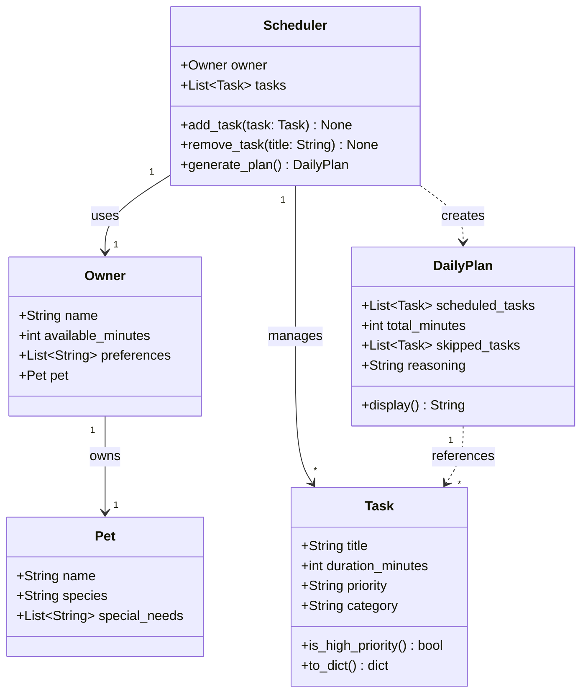

# PawPal+ Project Reflection

## 1. System Design

**Core user actions:**

1. **Enter owner and pet information.** The user provides basic profile details — their name, available time per day, and their pet's name, species, and any special needs. This context is used by the scheduler to personalize and constrain the daily plan.

2. **Add and edit care tasks.** The user can create tasks such as walks, feeding, medication, grooming, and enrichment activities. Each task has at least a name, estimated duration, and priority level. Users can also edit or remove existing tasks as their pet's needs change.

3. **Generate a daily care plan.** The user requests a schedule that fits within their available time. The app prioritizes tasks by importance, respects time constraints, and displays the resulting plan along with a brief explanation of why tasks were included, ordered, or omitted.

**a. Initial design**

The system is built around four main objects:

**Owner**
- Attributes: `name` (str), `available_minutes` (int), `preferences` (list of str — e.g., prefers morning walks)
- Methods: `get_available_time()` → returns how many minutes are free today; `update_preferences(prefs)` → updates the preference list

**Pet**
- Attributes: `name` (str), `species` (str), `special_needs` (list of str — e.g., "takes medication at noon")
- Methods: `get_profile()` → returns a summary dict used by the scheduler to inform task selection

**Task**
- Attributes: `title` (str), `duration_minutes` (int), `priority` (str: "low"/"medium"/"high"), `category` (str — e.g., "exercise", "nutrition", "medical")
- Methods: `is_high_priority()` → bool; `to_dict()` → serializable dict for display

**Scheduler**
- Attributes: `owner` (Owner), `pet` (Pet), `tasks` (list of Task)
- Methods: `add_task(task)` → adds a task to the pool; `remove_task(title)` → removes by title; `generate_plan()` → returns a `DailyPlan` by selecting and ordering tasks that fit within `owner.available_minutes`, prioritizing by priority then duration

**DailyPlan**
- Attributes: `scheduled_tasks` (list of Task in order), `total_minutes` (int), `skipped_tasks` (list of Task), `reasoning` (str)
- Methods: `display()` → returns a formatted string listing each task, why it was included, and what was skipped and why

Relationships: `Scheduler` owns one `Owner` and one `Pet`, and holds a collection of `Task` objects. `Scheduler.generate_plan()` produces a `DailyPlan`.

**UML Class Diagram:**

- What classes did you include, and what responsibilities did you assign to each?

**b. Design changes**

- Did your design change during implementation?
- If yes, describe at least one change and why you made it.

---

## 2. Scheduling Logic and Tradeoffs

**a. Constraints and priorities**

- What constraints does your scheduler consider (for example: time, priority, preferences)?
- How did you decide which constraints mattered most?

**b. Tradeoffs**

- Describe one tradeoff your scheduler makes.
- Why is that tradeoff reasonable for this scenario?

---

## 3. AI Collaboration

**a. How you used AI**

- How did you use AI tools during this project (for example: design brainstorming, debugging, refactoring)?
- What kinds of prompts or questions were most helpful?

**b. Judgment and verification**

- Describe one moment where you did not accept an AI suggestion as-is.
- How did you evaluate or verify what the AI suggested?

---

## 4. Testing and Verification

**a. What you tested**

- What behaviors did you test?
- Why were these tests important?

**b. Confidence**

- How confident are you that your scheduler works correctly?
- What edge cases would you test next if you had more time?

---

## 5. Reflection

**a. What went well**

- What part of this project are you most satisfied with?

**b. What you would improve**

- If you had another iteration, what would you improve or redesign?

**c. Key takeaway**

- What is one important thing you learned about designing systems or working with AI on this project?
