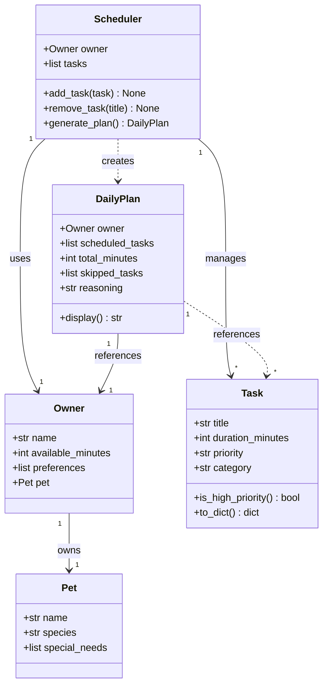

# PawPal+ Project Reflection

## 1. System Design

**Core user actions:**

1. **Enter owner and pet information.** The user provides basic profile details — their name, available time per day, and their pet's name, species, and any special needs. This context is used by the scheduler to personalize and constrain the daily plan.

2. **Add and edit care tasks.** The user can create tasks such as walks, feeding, medication, grooming, and enrichment activities. Each task has at least a name, estimated duration, and priority level. Users can also edit or remove existing tasks as their pet's needs change.

3. **Generate a daily care plan.** The user requests a schedule that fits within their available time. The app prioritizes tasks by importance, respects time constraints, and displays the resulting plan along with a brief explanation of why tasks were included, ordered, or omitted.

**a. Initial design**

The design uses five classes. `Owner` and `Pet` are pure data holders that represent the people and animals involved. `Task` models a single care activity. `Scheduler` contains the planning logic. `DailyPlan` is the output object the UI displays.

**Owner** — holds the context that constrains the schedule.
- Attributes: `name`, `available_minutes`, `preferences`, `pet` (Owner owns the Pet)
- No behavior methods; its data is read directly by the Scheduler.

**Pet** — holds the pet's profile, referenced through Owner.
- Attributes: `name`, `species`, `special_needs`
- No behavior methods; its data informs which tasks the Scheduler considers.

**Task** — represents one care activity to be scheduled.
- Attributes: `title`, `duration_minutes`, `priority` ("low"/"medium"/"high"), `category`
- `is_high_priority()` → convenience check used during sorting
- `to_dict()` → serializes the task for display in the UI

**Scheduler** — the planning engine; owns the task pool and produces the plan.
- Attributes: `owner`, `tasks`
- `add_task(task)` / `remove_task(title)` → manage the task pool
- `generate_plan()` → selects and orders tasks that fit within `owner.available_minutes`, ranked by priority then duration; returns a `DailyPlan`

**DailyPlan** — the read-only output of `generate_plan()`.
- Attributes: `scheduled_tasks`, `total_minutes`, `skipped_tasks`, `reasoning`
- `display()` → returns a formatted string of the plan for the UI

**UML Class Diagram:**

- What classes did you include, and what responsibilities did you assign to each?

**b. Design changes**

Four changes were made after reviewing the initial design for missing relationships and logic bottlenecks:

1. **Added `priority` validation to `Task`** — the initial design stored `priority` as a plain string with no guard. Any typo (e.g. `"urgent"`, `"HIGH"`) would silently pass and sort incorrectly. A module-level `VALID_PRIORITIES` constant and a `ValueError` on `__init__` catch bad values at construction time rather than at scheduling time.

2. **Added `owner` reference to `DailyPlan`** — the plan had no way to identify whose schedule it was. Without this, `display()` could not say "Jordan's plan for Mochi." `DailyPlan.__init__` now accepts an `owner` parameter, and the UML relationship was updated to reflect this.

3. **Added uniqueness enforcement to `Scheduler.add_task()`** — the original flat list allowed duplicate task titles. A second `add_task()` call with the same title would create a silent duplicate, and `remove_task()` would only delete the first match. The method now raises `ValueError` if a task with the same title already exists.

4. **Added `available_minutes` validation to `Owner`** — a value of `0` or negative would cause `generate_plan()` to schedule nothing with no feedback. `Owner.__init__` now raises `ValueError` for negative values, making the failure explicit at the point of bad input.

---

## 2. Scheduling Logic and Tradeoffs

**a. Constraints and priorities**

- What constraints does your scheduler consider (for example: time, priority, preferences)?
- How did you decide which constraints mattered most?

**b. Tradeoffs**

- Describe one tradeoff your scheduler makes.
- Why is that tradeoff reasonable for this scenario?

---

## 3. AI Collaboration

**a. How you used AI**

- How did you use AI tools during this project (for example: design brainstorming, debugging, refactoring)?
- What kinds of prompts or questions were most helpful?

**b. Judgment and verification**

- Describe one moment where you did not accept an AI suggestion as-is.
- How did you evaluate or verify what the AI suggested?

---

## 4. Testing and Verification

**a. What you tested**

- What behaviors did you test?
- Why were these tests important?

**b. Confidence**

- How confident are you that your scheduler works correctly?
- What edge cases would you test next if you had more time?

---

## 5. Reflection

**a. What went well**

- What part of this project are you most satisfied with?

**b. What you would improve**

- If you had another iteration, what would you improve or redesign?

**c. Key takeaway**

- What is one important thing you learned about designing systems or working with AI on this project?
